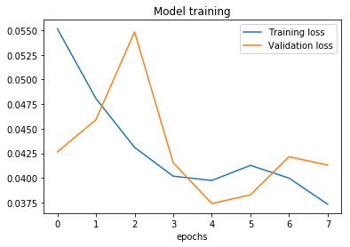

# Behavioral Cloning

## Project Report

This project consists of using a car simulator to record driving data 
(steering angle, throttle, break and speed) together with track images, 
feed this data into a deep learning network and clone the behavior of the
driver. The predictions of the network enable the simulator to run 
autonomously.

The steps of this project are the following:

- Use the simulator to collect driving data
- Create a convolutional neural network (CNN) with Keras and TensorFlow
- Train and validate the model with simulator data
- Test the model to successfully drive around the track without leaving the road
- Describe and discuss results

### Files

This project has four main files:

- [`model.py`](./model.py) - Keras/TensorFlow architecture implemented in Python
- [`drive.py`](./drive.py) - provided WSGI server (Flask + SocketIO) to send predictions back to the simulator,
and also a PI controller to filter throttle and speed
- `model.h5` - Generated model in HDF format enabling the predictions to run elsewhere
- [`video.mp4`](./) - video created with the simulator in autonomous mode
- [`report.md`](./) - this report.

To run the simulator autonomously, execute:

```python 
python drive.py model.h5
```

The `model.py` is commented and follows [PEP8](https://www.python.org/dev/peps/pep-0008/). 
The model uses [Python generators](https://wiki.python.org/moin/Generators),
not only by a rubric requirement, but also to be functional on available 
resources. Loading the whole dataset to memory is not feasible.

### Model Architecture

This project uses an architecture consisting of:

- 5 convolutional layers (which concern with image patterns)
- 4 fully connected layers (which concern more with steering)
- activations are RELU
- a Dropout layer is used to add non-linearity and avoid overfitting 

This arrangement of layers is suggested following the success of 
[NVIDIA Team](https://devblogs.nvidia.com/parallelforall/deep-learning-self-driving-cars/)
with self-driving cars. Although different in image size, the NVIDIA model
poses a great reference for this project.
Layer sizes are chosen to create a "pyramid" effect, typical of convolutional
nets, increasing the number of filters for the deeper layers as they reduce 
in width and height. For dense layers is done the opposite, decreasing size
towards the last layer.

Keras utilities are used to crop, normalize and center pixels (lines 140-144). 
By doing this within model layers, there no need to make any change 
in `drive.py`.

|Layer (type)               | Output Shape            | Param #  |
|---------------------------|-------------------------|----------|
|cropping2d_1 (Cropping2D)  |(None, 80, 320, 3)       | 0        |
|lambda_1 (Lambda)          |(None, 80, 320, 3)       | 0        |
|conv2d_1 (Conv2D)          |(None, 37, 157, 24)      | 3552     | 
|conv2d_2 (Conv2D)          |(None, 17, 77, 36)       | 21636    |
|conv2d_3 (Conv2D)          |(None, 7, 37, 48)        | 43248    |
|conv2d_4 (Conv2D)          |(None, 3, 33, 60)        | 72060    |
|conv2d_5 (Conv2D)          |(None, 1, 31, 72)        | 38952    |
|dropout_1 (Dropout)        |(None, 1, 31, 72)        | 0        |
|flatten_1 (Flatten)        |(None, 2232)             | 0        |
|dense_1 (Dense)            |(None, 48)               | 160776   |
|dense_2 (Dense)            |(None, 32)               | 4380     |
|dense_3 (Dense)            |(None, 16)               | 2928     |
|steer_angle (Dense)        |(None, 1)                | 49       |

Total params: *347,581*

Trainable params: *347,581*

Non-trainable params: *0*

For training it was chosen to use 80% of samples, 20% for validation
(line 118).
The optimizer is Adam with learning rate of 0.001, with decay of 1e-4. 
Running the generator for 10 epochs showed to be
enough (loss decreasing for both train and validation).
Loss function is mean squared error (line 186).
The ealy stop callback was set to 1e-3, patience=2 (line 178 and 196).
This callback did fire in epoch 00007.



The training data was recorded in distinct sessions, evaluating the model each
time, so it has generated 15 zip files (around 550MB). 
These recording sessions contain:

- about 2 full laps driving with the car in the center of the road
- 1 lap driving in zig-zag, exposing the model to "new" images
- recovering training in corners, driving the car from the edges in direction
the center of the road
- 1 full lap driving clockwise (reverse from default)
- focus on corners

So with this dataset we build an implicit constrain that the car should not
go off the road.

Below on the left, car crossing bridge (example of center image) and on the 
right car driving clockwise (right image).


Simulator driving autonomously communicating with model through socket.


The track One is run counter-clockwise with predominant left turns. To overcome
this caracteristic all images are duplicated and flipped, inverting the 
steering (lines 105-106).

### Simulation

The results can be tested with the car driving autonomously around track one.
Images were captured and created a [video file (MP4)](./video.mp4).

When driving autonomously the PI Controller keeps speed close to 9.


### Discussions

To come up with this solution several combinations of hyperparameters were
tried. Checking online forums has proven to be very helpfull and following
some previous guidelines were key to keeping the car on the track.

Also, it became clear that collecting and preparing data is crucial to achieve
a functional model. In this case, just driving around was never enough. Model
has to recognize implicitly the "fence" constrain and learn the correct path
once it's off the center.

Using all flipped, clockwise, center, left and right cropped images was important. 
Increasing layer size did not reflect automatically in better results, which
demonstrates the empirical nature of neural network training.


